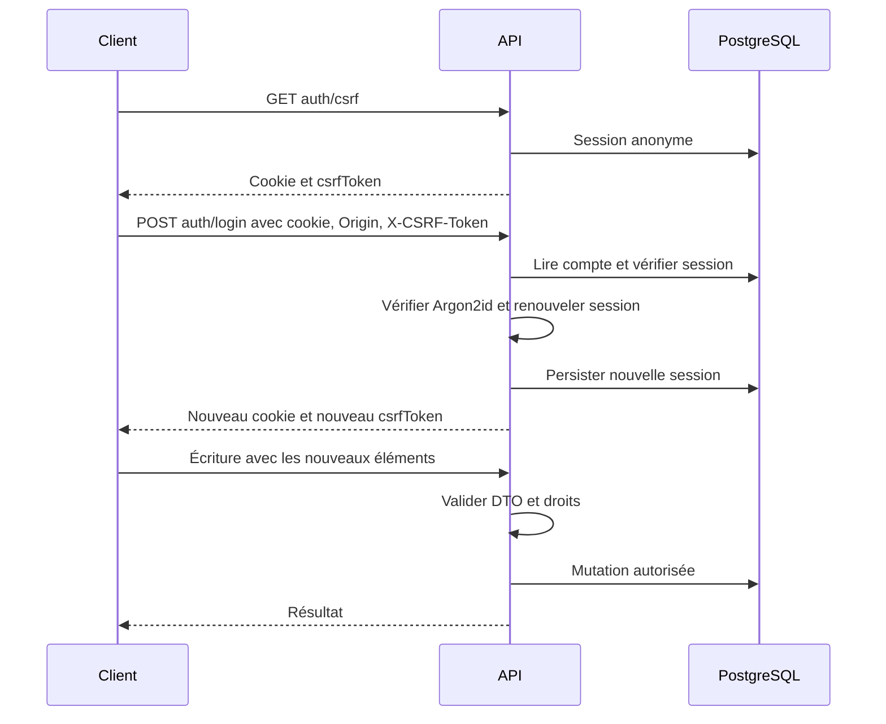
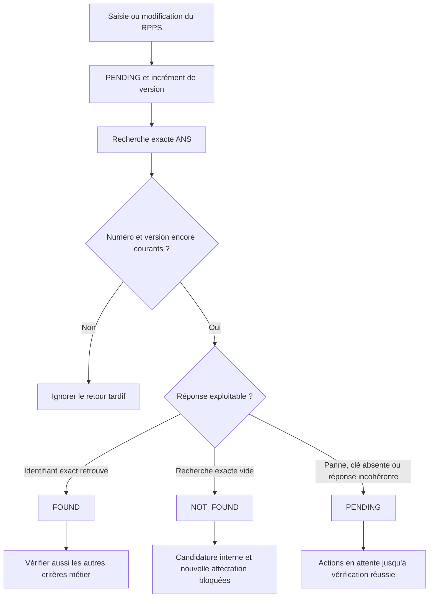
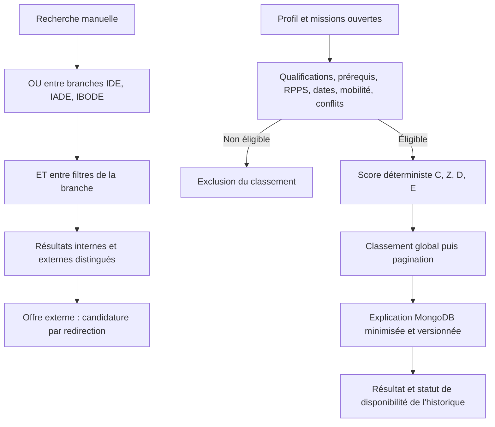
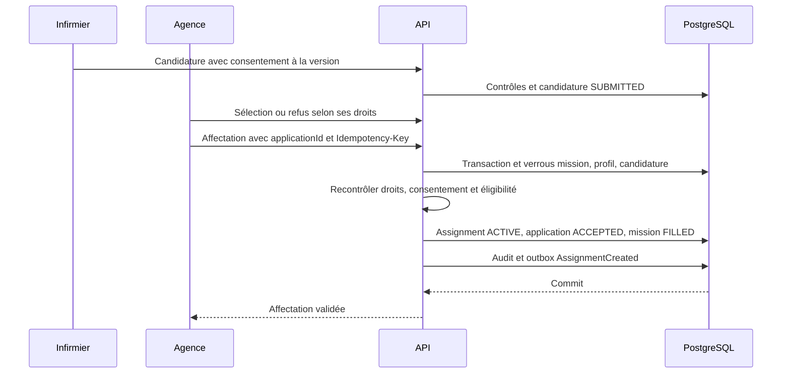
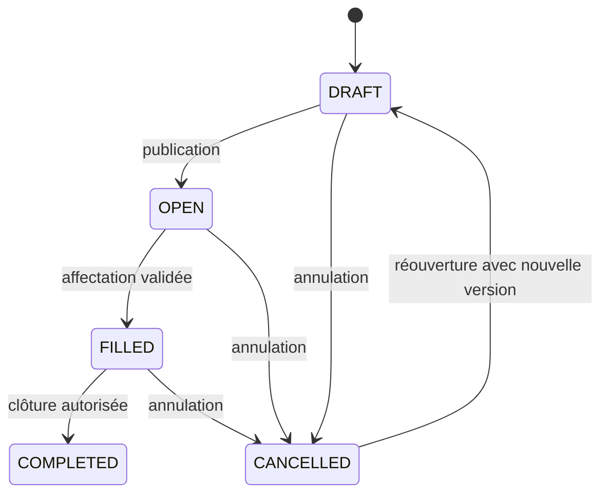
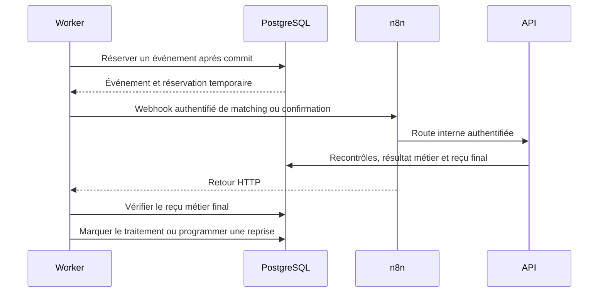
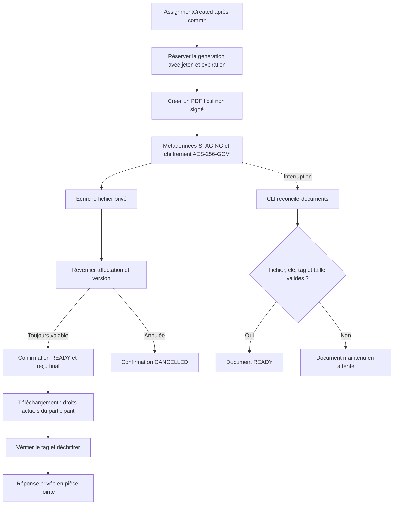

# Flux métier et techniques V1

Ces schémas décrivent le backend présent. Les scénarios testés et les limites sont dans les [exigences](REQUIREMENTS_V1.md) et la [reprise](REPRISE_BACKEND_V1.md). Les appels utilisateurs portent le préfixe `/api/v1`.

## Authentification et écritures

Un échec d'authentification ou de protection d'écriture interrompt ce parcours. La déconnexion détruit la session serveur. Les routes d'automatisation emploient une authentification de service distincte.

## RPPS : aucun contrôle manuel par l'agence

`NOT_CHECKED` ne satisfait pas non plus le contrôle. Le profil et la recherche restent accessibles. Un changement RPPS ne rétro-annule pas une affectation. Les réponses fournisseurs des tests sont simulées ; l'accès ANS réel reste à valider.

## Recherche et matching

Le score par défaut est `100 × (0,45 C + 0,25 Z + 0,20 D + 0,10 E)`. Les pondérations configurées changent la version des règles. La distance est calculée avec PostGIS. Les disponibilités doivent couvrir tout l'intervalle, après retrait des indisponibilités, avec des bornes semi-ouvertes.

Les champs externes inconnus excluent une offre des filtres stricts correspondants. Une offre externe ne devient pas une mission interne et ne reçoit pas le score complet interne. Les explications expirées, liées à un profil ou à une mission modifiés sont signalées comme périmées.

## Candidature et affectation humaine

Le même identifiant d'idempotence avec le même contenu renvoie le résultat initial ; un contenu différent produit un conflit. Un conflit de disponibilité empêche le commit. Une modification substantielle ou une réouverture exige un consentement à jour. La sélection seule ne constitue pas une affectation.

## États des missions

Une mission terminée ne peut pas être rouverte. L'annulation met à jour mission, affectation et statut de confirmation dans une transaction ; le document historique reste identifiable comme annulé.

## Trois workflows n8n

- A — `matches.json` : mission publiée ou demande de recalcul → éligibilité et préférences actuelles → notification interne sans doublon.
- B — `reminders.json` : déclenchement horaire n8n → contrôle d'une mission ouverte, à venir et suffisamment ancienne → relance unique par fenêtre. Un webhook authentifié permet aussi la recette.
- C — `confirmation.json` : événement `AssignmentCreated` → génération backend du PDF fictif non signé → accès privé et notifications.

Le worker réserve pendant 90 secondes et reprend avec temporisation exponentielle, au maximum cinq tentatives. Un HTTP 200 sans reçu final ne suffit pas. Une panne d'automatisation n'annule pas l'affectation déjà validée.

## Confirmation et documents privés

La réconciliation documentaire ne remplace pas la reprise métier de la confirmation. Les anciennes clés restent nécessaires aux anciens documents. Aucun document, clé ou fichier `.env` n'entre dans le bundle Git. Ce PDF n'est pas un contrat signé ; contrats F24 en V3, attestation en V2 et références hors V1.
