# Architecture InfiMatch V1

Vue synchronisée avec le backend du commit `05e1711`. API, worker et CLI partagent le code NestJS ; le worker est un processus séparé. Le frontend reste à intégrer et les accès fournisseurs réels à valider. Le proxy HTTPS appartient au déploiement restant à réaliser.

```mermaid
flowchart LR
    subgraph client["Accès"]
        caller["Client HTTP local"]
        front["Frontend Next.js prévu"]
    end
    subgraph service["Backend : même code NestJS"]
        api["API HTTP : main.ts"]
        worker["Worker outbox : worker.ts"]
        cli["CLI : cli.ts"]
    end
    subgraph datastore["Stockages locaux privés"]
        sql["PostgreSQL / PostGIS : vérité métier"]
        mongo["MongoDB : explications de matching"]
        files["Fichiers privés AES-256-GCM"]
    end
    subgraph async["Automatisation"]
        n8n["n8n : 3 workflows et volume technique"]
    end
    subgraph external["Accès réels restant à valider"]
        ans["ANS : RPPS"]
        ft["France Travail : offres, accès vérifié"]
        finess["ANS / data.gouv.fr : snapshot FINESS"]
    end
    caller -->|"Cookie, Origin, CSRF"| api
    front -.->|"Intégration à réaliser"| api
    api -->|"Transactions, sessions, audit, outbox"| sql
    api -->|"Historique minimisé et expiration"| mongo
    api -->|"Chiffrement et téléchargement autorisé"| files
    worker -->|"Réservation et reçu final"| sql
    cli -->|"Migrations, import, réparation documentaire"| sql
    cli -->|"Réconciliation des fichiers"| files
    worker -.->|"Événements après commit"| n8n
    n8n -.->|"Routes internes authentifiées"| api
    api -.->|"Recherche exacte RPPS"| ans
    cli -.->|"Acquisition des offres"| ft
    cli -.->|"Import du fichier officiel téléchargé"| finess
```

PostgreSQL est la source de vérité des comptes, affiliations, profils, missions, candidatures, affectations, sessions, favoris, notifications, audits, métadonnées documentaires et événements. PostGIS et btree_gist sont des extensions de cette même base. Les migrations remplacent toute synchronisation automatique du schéma.

MongoDB conserve uniquement les explications minimisées et versionnées du matching. Sa panne ne doit pas être interprétée comme une absence de correspondances : l'API signale l'indisponibilité de l'historique. Les fichiers chiffrés restent privés et sont délivrés par l'API après contrôle des droits.

n8n orchestre trois workflows. Les règles métier et la génération PDF restent dans le backend ; n8n possède son propre volume technique. Aucun fournisseur ne décide d'une affectation. L'agence valide humainement l'affectation, sans ajouter une validation manuelle du RPPS.

Les pointillés représentent les intégrations externes, asynchrones ou prévues, selon leur libellé. Les connexions du Compose sont locales ; ce dessin ne constitue pas une preuve de TLS en production. Aucun connecteur FINESS réel n'est représenté : le champ FINESS est obligatoire pour un établissement, mais ne confère aucun droit d'accès.

Source modifiable : [architecture-v1.mmd](architecture-v1.mmd). Voir le [plan des fichiers](PLAN_ARCHITECTURE_V1.md), les [flux détaillés](FLUX_V1.md), les [exigences](REQUIREMENTS_V1.md) et la [reprise](REPRISE_BACKEND_V1.md).

Mise à jour : France Travail et FINESS importés réellement ; [preuves et limites](ACQUISITION_REELLE.md).
